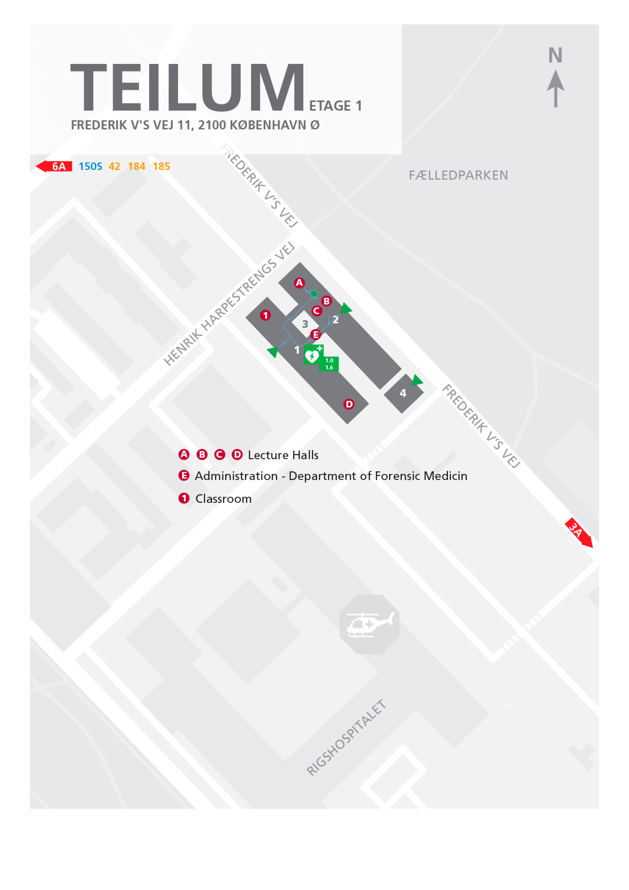

# IT-security (ITS) B1 2019/20

## How to get to Teilum, Auditorium A
As the August Krogh building is being renovated this semester, Science have borrowed some auditoriums from SUND; they are specifically located in the building called Teilum, beside Fælledparken, north of Rigshospitalet. We have been assigned one of them.

The building has been fitted with some benches similar to the ones you know from HCØ. Teilum hosts Retsmedicinsk Institut, so the building will be closed outside office hours and don't roam the hallways.

The building is located at __Frederik V's Vej 11, 2100 Kbh__ and all auditoriums are accessible from the ground floor. The following map can guide you to Auditorium A. (Though is says "Etage 1" it is the ground floor.) Enter from either side of the building (the two green arrows) and follow the beautifully drawn blue line until you get to the (almost) circular green marking. (Don't mind the random blue lines at the end; you can enter the auditorium without walking randomly around outside.)

